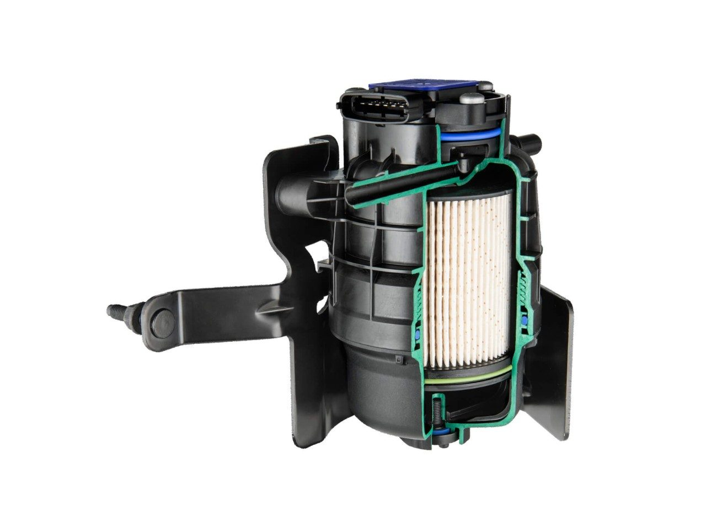

OEM-Kraftstofffilter: Moderne Filtration für ein längeres Motorleben

Unreiner Kraftstoff stellt für moderne Einspritzsysteme eine enorme Belastung dar. Schmutzpartikel und Wasser können beim Herstellungsprozess, bei der Lagerung und dem Transport sowie während des Betriebs in den Kraftstoff gelangen. Die Verschmutzung kann dann zu Korrosion, Verschleiß bis hin zum Motorausfall und einem erhöhten Kraftstoffverbrauch führen.

I have a device producing small data files all the time. I want to stream them into a google cloud storatge container.